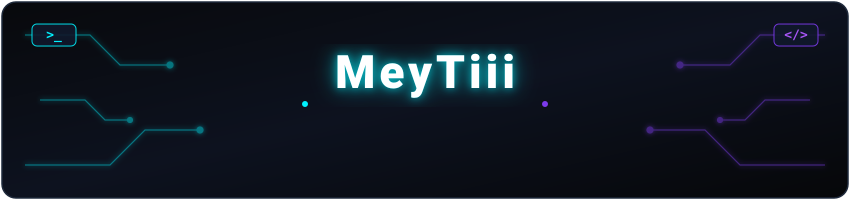

<!-- Cyber Header Banner matching PFP Neon Aesthetics -->

  

 

  <!-- Monospace Cyber Typing Animation -->
  

    

  <!-- Neon Glowing Cyber Badges -->
  

    
    
    
  

  

  <!-- Profile Overview Card -->
  
  
    
  
  <!-- Languages & Commits -->
  
  

    

  <!-- Stats & Productive Time -->
  
  

 

  

  <picture>
    <source media="(prefers-color-scheme: dark)" srcset="https://raw.githubusercontent.com/meytiii/meytiii/output/github-contribution-grid-snake-dark.svg" />
    <source media="(prefers-color-scheme: light)" srcset="https://raw.githubusercontent.com/meytiii/meytiii/output/github-contribution-grid-snake.svg" />
    
  </picture>

 

<!-- Footer matching Cyberpunk Neon Palette -->

  

